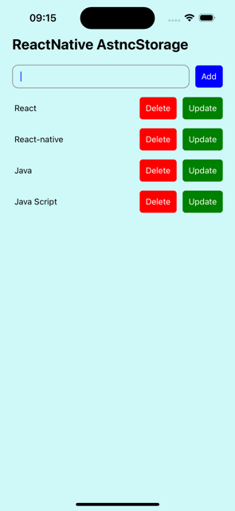

# React Native Todo App

## About the Project

This is a simple and intuitive todo app built with React Native. The app allows users to add, remove, and manage their tasks efficiently on their mobile devices.

## Video gif


## App Screen



## Features

- Add new tasks
- Mark tasks as completed
- Delete tasks
- Simple and clean user interface

### Technologies and Libraries Used

- React Native
- react-native-uuid
- @react-native-async-storage/async-storage

### clone the repository

```
git clone https://github.com/ozerbaykal/react-native-asyncStorage.git
```

### Navigate to the project directory:

```
cd react-native-asyncStorage
```

### Install the dependencies:

```
npm install
```

### Run the app on a simulator or device:

```
npm start

```

## Contributing

Contributions are welcome! Please open an issue first to discuss what you would like to change.

- 1.Fork the project
- 2.Create your feature branch (git checkout -b feature/NewFeature)
- 3.Commit your changes (git commit -m 'Add new feature')
- 4.Push to the branch (git push origin feature/NewFeature)
- 5.Open a Pull Request

<h2>Contact</h2>

Özer BAYKAL mail : baykalozer87@gmail.com

Project Link: https://github.com/ozerbaykal/react-native-asyncStorage
